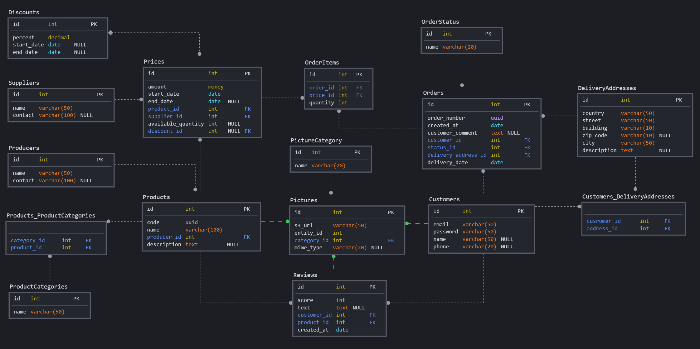

# База данных Интернет магазина

Данный проект описывает базу данных типичного интернет магазина.

1. [Бизнес задачи, решаемые базой данных](#бизнес-задачи-решаемые-базой-данных)
2. [Основные сущности](#основные-сущности)
3. [Схема Базы данных](#схема-базы-данных)
4. [Возможные запросы](#возможные-запросы)
5. [Кардинальность полей](#кардинальность-полей)
6. [Индексы](#индексы)
7. [Ограничения](#ограничения)

## Бизнес задачи, решаемые базой данных

- Учет доступных к продаже товаров
- Объединение товаров в категории
- Наличие нескольких цен для одного товара в зависимости от поставщика
- Возможность совершать заказы зарегистрированным пользователям (Заказчикам) 
- Поддержка нескольких позиций в заказе с разным количеством товара для каждой позиции
- Поддержка списка адресов доставки
- Применение скидки
- Возможность оставить отзыв к купленному товару
- Хранение мета информации о всех изображениях, используемых в описании товаров, профилях пользователей и отзывах.

## Основные сущности

- ### _Товар_
  - Код
  - Название
  - Описание
  - Производитель
  - Изображения
  - Категории
  - Цены
  - Отзывы

- ### _Цена_
  - Значение
  - Товар 
  - Начальная дата
  - Конечная дата
  - Поставщик (предоставивший товар по данной цене)
  - Доступно товара (по данной цене)
  - Скидка
  
- ### _Скидка_
  - Процент
  - Дата начала
  - Дата окончания
  

- ### _Заказчик_
  - Email
  - Пароль
  - Имя
  - Телефон
  - Адреса доставки
  - Аватар

- ### _Заказ_
  - Номер
  - Дата создания
  - Позиции 
  - Заказчик
  - Статус
  - Адрес доставки
  - Дата доставки
  - Комментарий заказчика

- ### _Позиция заказа_
  - Товар
  - Цена
  - Количество

- ### _Адрес доставки_
  - Страна
  - Город
  - Улица
  - Номер дома
  - Почтовый индекс
  - Описание

- ### _Отзыв_
  - Оценка (численная)
  - Текст
  - Фотографии
  - Товар
  - Заказчик
  - Дата создания

- ### _Изображение_
  - S3 url
  - Сущность (к которой относится изображение)
  - Категория (аватар, фото товара и т.д.)
  - Mime type
  
## Схема Базы данных

## Возможные запросы
- Регистрация (создание) нового пользователя (заказчика)
- Добавление аватара
- Редактирование данных профиля заказчика  
- Добавление товаров в каталог магазина
- Изменение товаров: редактирование описания, добавление фотографий, назначение категорий
- Назначение цены товарам от разных поставщиков
- Применение скидки
- Поиск товаров по категории, названию, цене, производителю, скидке
- Создание нового заказа
- Изменение статуса существующего заказа
- Создание и редактирование адресов доставки
- Создание отзыва к товару
- Суммарный отчет по заказам за месяц: количество, стоимость, объем
- Отчет по самым продаваемым товарам в определенный период времени
- Отчет по предпочтениям заказчиков: срез заказываемых товаров и профильных данных пользователей

## Кардинальность полей

###_Products_

| Поле | Кардинальность |
|----------|-------------|
| id | средняя |
| code | низкая |
| name | высокая |
| description | средняя |

## Индексы

## Ограничения
